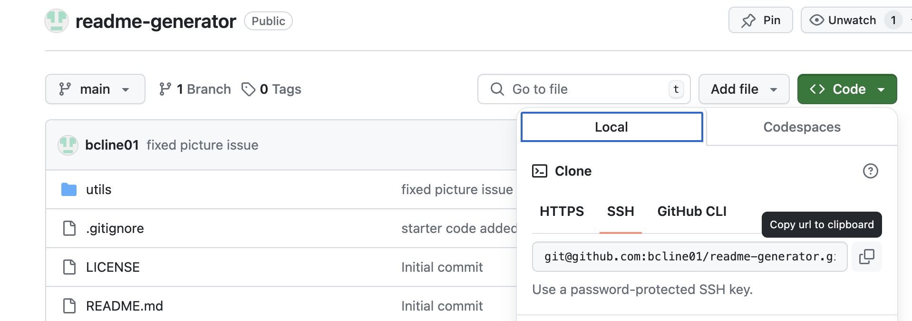

## readme-generator  

## Description
  With this README generator, you no longer need to create a professional README from scratch. Simply answer a few questions and watch as a README is created before your very eyes. 

  ## Table of Contents
  1. [Description](#description)
  2. [Installation](#installation)
  3. [Usage](#usage)
  4. [DemoVideo](#demovideo)
  5. [Credits](#credits)
  6. [License](#license)
  7. [features](#features)
  8. [Contributors](#contribute)
  9. [Test](#test)

  ## Installation
  Clone the respository from my **[GitHub](https://github.com/bcline01/readme-generator)**

     
    NPM: Use the command "npm init -y" to install Node Package Manager 
    Inquirer: Use the command "npm install inquirer" to get npm's inquirer package

  ## Usage
    Within the directory for this project, initialize prompts using the command "node index.js".

    From there, simply enter the necessary information for your project and a new README file will be generated and placed into the 'dist' folder.

  ## DemoVideo    

  ## Credits
    Made by bcline01 GitHub: **[GitHub](https://github.com/bcline01)**

    If you have any questions, please contact me at <mailto:brookecline.dev@gmail.com>

  ## License
    This project is licensed under the **[MIT](https://opensource.org/licenses/MIT)** license.

    Click the license above to learn more about this license.

  ## Features
    Simplifies the creation of professional README files

    Interactive prompts for user input

    Supports multiple licenses

  ## Contributing (Github usernames)
    No other contributors helped in producing this original project.

    If you would like to contribute to this project, please fork the repository and create a pull request. 
    
    For major changes, please open an issue first to discuss what you would like to change.

  ## Tests
    To run tests, use the following command: npm run test